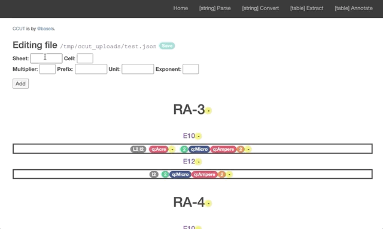

# CCUT Wrapper
Wrapper infrastructure (UI/Evaluation) for [CCUT](https://github.com/basels/ccut/), a framework for the identification and transformation of units of measure.

This repository provides the following:
* Allows running the CCUT service (parsing, transformation) over a UI
* Allows generating and creating annotation files (`json`) for spreadsheets
* Provides additional validation tools to run CCUT over spreadsheets (`xlsx`) and validate them (`json`)

## Installation
With `pip`:
```
pip install -r requirements.txt
```

### UI:
How to run:
```
python ui/api.py
```
Navigate to `http://localhost:localport/` (usually set as `http://0.0.0.0:5000/`).<br />
The UI allows performing the following operations over the browser:

#### Parse a `string` (get unit representation)


#### Convert `string`s (get units transformation)


#### Extract units from `xlsx` (get a suggested `json` annotation file)


#### Annotate `json` (upload and edit existing `json` annotation file)



### Spreadsheets Validator:
#### Generate a `json` dictionary file of detected units
Run `ccut_sheets.py` over an `xlsx` file. As in:
```
python ui/ccut_sheets.py -i my_spreadsheet.xlsx
```
This will produce a file called `my_spreadsheet.ccut.json`

#### Validate a directory of spreadsheets files and their `json` results files
Run `ccut_sheets_validator.py` over a directory of `xlsx` files and their matching `json`s. As in:
```
python ui/ccut_sheets_validator.py -d my_dir/
```